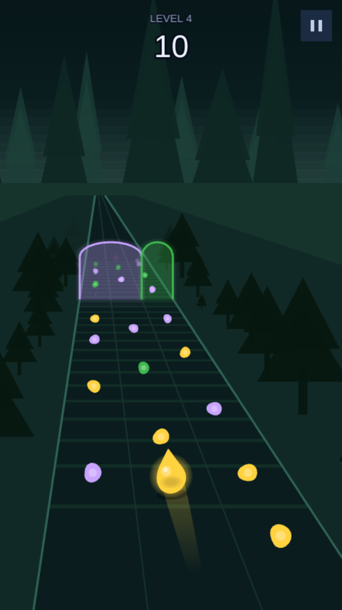

# DON'T FLOW

A mobile web game built with [Phaser 4](https://phaser.io) and TypeScript.

**▶ [Play it](https://terrormaximaal.github.io/Dont-Flow/)** — deployed from `main`
on every push.

You are a drop flowing down a track. Colour gates repaint you; after each gate,
collect the orbs that match your colour and avoid the ones that do not. Keep the
streak going, because every three in a row raises what the next one pays. Reach
the finish with the best score you can.



## Status

What is in:

- Automatic forward motion down a road drawn in perspective
- Swipe / arrow-key lane changes that slide rather than snap
- Two lanes for the first two levels, three from the third
- Colour gates spanning the track, whose colour floods down through the drop
- Matching colours score and build a combo; a wrong colour costs double, breaks
  the combo, flashes the drop and kicks the screen
- A combo multiplier: every three in a row pays one step more, up to five times
- The drop swells as the score climbs, and leaves a wet streak behind it
- Rainbow drops: a pickup that matches every colour for nine rows
- Ten levels of 24 to 28 seconds, each with its own world, palette, layout,
  speed and row spacing
- Coloured barriers that are only safe to pass while carrying their colour,
  in three kinds introduced one at a time: static, sliding and pulsing
- Saved progress: best score per level, and a reload resumes the level you were
  on
- A title screen and a level select, unlocked as far as you have reached
- Energy, currently switched off — see below

There is no way to lose. A barrier costs points and the combo; it never ends the
run, and the finish is always reached. Score resets at the start of each level -
only the per-level best is kept.

## Requirements

[Node.js](https://nodejs.org) is required to install dependencies and run the
npm scripts.

| Command | Description |
|---|---|
| `npm install` | Install dependencies |
| `npm run dev` | Development server on `http://localhost:8080` |
| `npm run build` | Production build into `dist` |
| `npm run dev-nolog` / `npm run build-nolog` | Same, without the template's anonymous ping (see below) |
| `npm test` | Run the test suite |
| `npm run test:watch` | Run it in watch mode |
| `npx tsc --noEmit` | Type-check |

## Controls

| Input | Action |
|---|---|
| Swipe left / right | Move one lane. A single drag can cross the track without lifting your finger. |
| Arrow keys, or A / D | Move one lane |
| Tap **NEXT LEVEL** / **START OVER**, or space / enter | Continue from the completion screen |
| Tap **RETRY** | Replay the level you just finished |
| Tap the pause button, or press escape | Pause, with resume / retry / menu |

Vertical drags are ignored, so a scroll-like gesture does not steer.

Two lane changes inside one unbroken drag are paced by `SWIPE_REPEAT_DELAY`.
Without it a fast flick fires both in consecutive frames and the drop appears at
the far edge rather than travelling there. It is held below the gap between two
rows on the quickest level, so crossing the track is always possible in the time
a level allows. Separate flicks and the keyboard are never held up.

### Orientation

The game is portrait only. On a phone held sideways the playfield would collapse
to a sliver, so a "rotate your device" notice covers the screen and the run
pauses until it is turned back - no distance is lost.

The trigger is landscape **and** a short viewport, not landscape alone, because a
desktop window is landscape too and stays keyboard-playable. It is defined twice
and the two must be kept in step:

- `BLOCK_LANDSCAPE_QUERY` in `src/game/config/constants.ts` (pauses the run)
- the matching `@media` block in `public/style.css` (shows the notice)

## Project structure

Each system lives in its own file and knows as little as possible about the
others.

| Path | Responsibility |
|---|---|
| `src/game/config/constants.ts` | Every tunable value in the game |
| `src/game/config/level.ts` | The level format, and compiling one into a course |
| `src/game/config/levels.ts` | The levels themselves |
| `src/game/config/worlds.ts` | The environment format |
| `src/game/config/worldData.ts` | The ten worlds |
| `src/game/scenes/Title.ts` | Title screen, and where the game boots |
| `src/game/scenes/LevelSelect.ts` | Level tiles, unlocked from saved progress |
| `src/game/scenes/Play.ts` | Wires the systems together and owns forward distance |
| `src/game/entities/Drop.ts` | The player: lane easing, lean, colour, size, hit flash |
| `src/game/entities/drop-surface.ts` | The drop's outline, as pure geometry |
| `src/game/entities/drop-juice.ts` | Its size, pop and idle wobble |
| `src/game/entities/GatePair.ts` | Two colour gates spanning the track |
| `src/game/entities/Orb.ts` | A lane-anchored collectible |
| `src/game/entities/Obstacle.ts` | A coloured barrier: static, sliding or pulsing |
| `src/game/entities/Rainbow.ts` | The power-up, waiting in a lane |
| `src/game/entities/FinishGate.ts` | The chequered finish band |
| `src/game/systems/InputSystem.ts` | Swipe and keyboard, to lane-change intents |
| `src/game/systems/Course.ts` | Owns placed objects and reports what the drop passed |
| `src/game/systems/PowerUps.ts` | The rainbow drops laid along a course |
| `src/game/systems/TrackScroller.ts` | The road, drawn in perspective |
| `src/game/systems/Environment.ts` | Sky, horizon haze and parallax silhouettes |
| `src/game/systems/Roadside.ts` | Scenery passing at road speed |
| `src/game/systems/Trail.ts` | The wet streak the drop leaves behind |
| `src/game/systems/Lanes.ts` | The lane layout this level asked for |
| `src/game/systems/World.ts` | Track distance to screen y |
| `src/game/systems/Projection.ts` | Track space to the diagonal corridor, at draw time only |
| `src/game/systems/contact.ts` | Which gate, and what the drop is touching |
| `src/game/systems/barrier.ts` | Where a barrier is, as functions of distance |
| `src/game/systems/swipe.ts` | The gesture rules, as pure functions |
| `src/game/systems/ScoreSystem.ts` | Score, combo and the multiplier |
| `src/game/systems/SaveSystem.ts` | Progress in localStorage |
| `src/game/systems/EnergySystem.ts` | Energy in hand, and refilling it over time |
| `src/game/systems/Effects.ts` | Absorbing an orb, and haptics |
| `src/game/systems/OrientationGuard.ts` | Pauses the run while the device is sideways |
| `src/game/ui/Hud.ts` | Score and multiplier readout |
| `src/game/ui/LevelComplete.ts` | End-of-run panel |
| `src/game/ui/PauseButton.ts` | The pause control shown during play |
| `src/game/ui/PauseOverlay.ts` | The paused panel |
| `src/game/ui/EnergyMeter.ts` | Energy in hand, and the wait for the next |
| `src/game/ui/Button.ts` | The tappable label every screen uses |
| `src/game/ui/FloatingScore.ts` | Points won or lost, rising from the hit |
| `src/game/ui/shapes.ts` | Painting the drop, shared by the player and the logo |
| `src/game/utils/color.ts` | Mixing colours, and the rainbow wheel |

### How position works

Nothing on the course stores a screen position. Every gate and orb sits at a
**distance along the track**, and `World.screenYFor()` converts that to a screen
y using how far the drop has travelled. The drop itself never moves vertically -
the track scrolls past it.

This is also what makes hit detection simple: an object is reached the moment
travelled distance passes its distance, which cannot tunnel at any speed.

### How the perspective works

The world is drawn as a road running away to a horizon, but it is still
**authored flat**: a lane gives an x, a distance gives a depth.
`systems/Projection.ts` is the only file that knows the world is seen in
perspective.

Two rules do all of it:

- `World.screenYFor()` turns a distance into a screen y as `k / (ahead + k)`,
  so far things barely move, near things rush past, and nothing crosses the
  horizon;
- `Projection.projectX()` pulls every point towards the vanishing point in
  proportion to its depth, which gives convergence, the narrowing of the road
  and its diagonal run all at once.

Collision never calls either. Hits are decided on track coordinates, so the
camera can be raised, lowered or straightened with no gameplay consequence -
there is no second copy of the geometry to keep in step.

The projection is the identity at the drop's own line, so the lane the player
is steering in never slides under them and what is drawn provably agrees with
what is collided.

Two properties the rendering depends on, both tested:

- it is **linear in screen y**, so straight lines stay straight and every line
  on the road can be drawn from just its two projected endpoints;
- the road **stays on screen for its whole visible length**, because a road
  that ran off the edge would hide oncoming objects.

Moving barriers take their position from a single function of distance
travelled, called by both the renderer and the collision check, so a barrier
cannot be drawn in one place and collided in another.

### How the drop is drawn

The drop is not a shape that gets scaled. Its outline is **rebuilt every frame**
from two overlapping ripples, which is what makes it read as liquid rather than
as a sprite being squashed. On top of that its tip trails behind a sideways
move, the highlight and shaded underside slide against it, and swallowing an orb
throws the whole surface into a splash that settles.

`entities/drop-surface.ts` holds the geometry as pure functions - same inputs,
same outline, no Phaser - so the numbers can be tuned and reasoned about on their
own. `ui/shapes.ts` decides how that outline is lit.

None of it is gameplay: collision reads `DROP_CONTACT_RADIUS`, which never
changes, so a drop grown fat on a good score is no harder to steer past a
barrier than a small one.

## Scoring

Ten points an orb, multiplied by the combo. Every `COMBO_STEP` orbs in a row
raises the multiplier by one, up to `COMBO_MAX_MULTIPLIER`; a wrong colour drops
it straight back to one.

The flat penalty is the small half of a mistake. The real cost is being knocked
from five times back to one, which is why the penalty itself does not also
scale. Both constants are sized against the levels: they hold enough orbs of one
colour that the cap lands about two thirds through a clean run.

## The rainbow drop

A pickup ('`*`' in a row) that makes the drop match everything for a stretch -
every orb scores and no barrier blocks.

It is measured in **rows**, not seconds or pixels. A level's rows are its
opportunities, so `RAINBOW_ROWS` of them is worth the same on a slow early level
as on a fast late one; seconds would be worth less where rows come quickly, and
pixels more.

Over the last `RAINBOW_WARNING` of it the colours race and the drop pulses. It
must never simply stop: hitting a barrier because the power-up quietly lapsed is
the definition of unfair. Taking a second one while the first is still running
extends it from now rather than stacking, so it cannot be banked.

## Tuning the feel

All tunable values live in `src/game/config/constants.ts`. The ones that matter
most:

| Constant | Effect |
|---|---|
| `FORWARD_SPEED` | How fast the track flows past, in pixels per second |
| `LANE_CHANGE_SPEED` | Lane-slide smoothing rate. Higher is snappier, lower is floatier. It is an exponential rate constant, not a duration. |
| `SWIPE_THRESHOLD` | How far a drag must go to count as one lane change |
| `SWIPE_REPEAT_DELAY` | Pacing between two lane changes in one drag |
| `COMBO_STEP` / `COMBO_MAX_MULTIPLIER` | What a streak is worth |
| `ENERGY_ENABLED` | Whether levels cost anything to start |

## Authoring a level

Levels live in `src/game/config/levels.ts` as entries in `LEVELS`, and are played
in array order. `level.ts` holds the format and the compiler; `levels.ts` holds
only content, so adding a level never means touching game code.

A level names a `world` (its environment) and a `palette`. Everything else refers
to colours by **position in that palette**, so a level can be re-tinted in one
place without touching its layout. A level's palette must be exactly what its
world declares.

It may also ask for `lanes: 2`. The road keeps its width, so two lanes are half
again as wide and there is only ever one direction to go - markedly gentler
without slowing anything down. The first two levels use it to teach the colour
rule before asking the player to choose a lane as well.

A level is a list of sections. Each section is one gate pair followed by rows,
written as text - one character per lane:

| Character | Meaning |
|---|---|
| `.` | empty |
| `1`-`5` | an orb of that palette colour |
| `a`-`e` | a barrier of that palette colour |
| `*` | a rainbow drop |

```ts
{
    name: '11',
    world: 'canyon',
    palette: [ 'orange', 'purple' ],
    lanes: 3,            // optional, defaults to 3
    forwardSpeed: 560,   // optional, defaults to FORWARD_SPEED
    rowSpacing: 140,     // optional, defaults to ORB_ROW_SPACING
    sections: [
        {
            splitAfterLane: 0,
            gate: [ 0, 1 ],        // orange gate | purple gate
            obstacles: 'slider',   // static | slider | pulse, defaults to static
            rows: [
                '1.a',             // orange orb, gap, orange barrier
                '.1b',
                '.*.'              // a rainbow drop in the middle lane
            ]
        }
    ]
}
```

`buildLevel()` expands the sections into absolute distances, so spacing comes
from the constants at the top of `level.ts` rather than being positioned by hand.

Difficulty runs on five dials, and leaning only on speed makes a level faster
rather than harder: `forwardSpeed`, `rowSpacing`, how many colours the palette
holds, how much a colour zig-zags between lanes, and which barrier kinds are
present. Lane count is a sixth, but only the early levels use it.

Rules the tests enforce, so a level cannot ship breaking them:

- **One character per lane.** A short row silently drops a lane; a long one puts
  an orb where there is no road. Both build without complaint.
- **A row is never completely full** - one short of the lane count, whatever that
  is, so there is always somewhere to dodge to.
- **Every row leaves a lane that is safe to be in** - empty, an orb, or a rainbow
  drop. An orb at worst costs points; a barrier can block the route outright, so
  a row of nothing but barriers has no way through.
- **Every row leaves a lane free of barriers whatever colour is carried**, worked
  out from where a moving barrier actually is when it is reached - and every
  level gives enough time between rows to get to it.
- **A gate pair's two halves are different colours**, or the choice means nothing.
- **Gates split on a lane boundary**, and a two-lane level can only split on the
  single boundary it has.
- **Each barrier kind appears before it is combined**, and level 1 has none at
  all.
- **Speed rises and row spacing falls with every level**, and the palette never
  shrinks.

## Saved progress

Progress lives in `localStorage` under `dont-flow.save`: the level you were last
on, the furthest you have reached, and the best score for each level. A reload
drops you back into the level you were on - set `RESUME_AT_LAST_LEVEL` to
`false` in `constants.ts` to always start at level 1 instead.

`SaveSystem` treats the stored value as hostile. It can be missing, corrupt,
written by an older build, sized for a different number of levels, or unreadable
outright - Safari's private mode throws on access rather than returning null.
Every one of those falls back to an empty save held in memory, so the game always
starts and only persistence is lost. Bumping `SAVE_VERSION` discards saves from
an incompatible format rather than guessing at a migration.

## Energy

**Currently switched off.** `ENERGY_ENABLED` in `constants.ts` is `false`, so
levels are free and unlimited and the meter is hidden. Waiting ten minutes to try
a change again is no way to judge whether it feels good. The system below is
intact and still tested; flip the constant to bring it all back.

Starting a level costs one energy, retries included. Energy refills with real
time, up to `MAX_ENERGY`. This is a limit on how much can be played in a sitting,
not health: it is charged once as a level begins and never affects a run in
progress.

Refills are worked out lazily from a single stored timestamp rather than ticked,
so time passes while the game is closed and there is no timer to keep alive.
`energyAt` marks the start of the interval currently being waited out, which is
why partial progress survives - 25 minutes at a 10 minute refill grants two
energy and keeps the remaining five minutes.

At the cap, nothing is stored and no timestamp is kept: spending starts a fresh
interval the moment energy drops below max, so time spent full cannot bank up.
That also keeps the menus from writing to `localStorage` on every frame, since
the meter polls this once per frame.

Energy trusts the device clock, so winding it forward grants energy. That is
inherent to storing progress locally; a server-checked clock is the only real
fix, and there is no server.

The scenes ask `mayStart()` and `charge()` rather than `canPlay()` and `spend()`,
so the switch lives in one place while `canPlay()` stays the honest answer about
the energy itself - which is what the meter and the tests are about.

## Tests

`npm test` runs the suite in `test/`. It covers the game's pure logic, which is
where the bugs that are hard to see live:

| File | Covers |
|---|---|
| `level.test.ts` | Compiling authored levels, and the rules the shipped levels are held to |
| `barrier.test.ts` | Where a moving barrier is when it is reached, and that every level stays passable |
| `drop-surface.test.ts` | The drop's outline, and clipping it for the colour flood |
| `score.test.ts` | Score, combo and the multiplier ladder |
| `swipe.test.ts` | The gesture rules, including the repeat delay |
| `contact.test.ts` | Which gate a position falls in, and catch range |
| `projection.test.ts` | That the perspective stays linear and on screen |
| `save.test.ts` | Reading back what was written, and every way a stored value can be hostile |
| `energy.test.ts` | Refill arithmetic, spending, and a clock that has moved backwards |
| `lanes.test.ts` | Lane geometry and clamping, in two lanes and in three |
| `worlds.test.ts` | That every world is complete and no level pairs colours you cannot tell apart |

Nothing here drives Phaser. These modules deliberately have no Phaser imports,
so they can be tested without a canvas or a DOM; the browser globals the save
needs are stubbed per test. Anything that does touch Phaser - scenes, entities,
rendering - is verified by running the game instead.

Several are regression guards for bugs that had already shipped into an otherwise
working build and were only caught by looking at real behaviour: energy wrote to
`localStorage` on every frame, and every moving barrier sat back in its own lane
at the exact moment of contact, so the movement decided nothing.

## Gotchas

- **No image assets.** Everything is drawn with Phaser shapes and graphics,
  including the effects - Phaser's particle emitter needs a texture, so they are
  plain shapes and tweens instead.
- **The `Phaser` global is types only.** Under the ESM build, `Phaser.Math.*`
  and friends type-check and then throw `Phaser is not defined` in the browser.
  Anything used at runtime must be imported. See `src/game/utils/math.ts`.
- **Haptics** go through `navigator.vibrate`, which is a silent no-op on iOS
  Safari and desktop.
- **The lane layout is shared state.** `systems/Lanes` holds how many lanes the
  level being played asked for, set once as it is built. Anything that changes it
  in a test has to put it back.

## About `log.js`

This project started from the official
[Phaser Vite TypeScript template](https://github.com/phaserjs/template-vite-ts),
which includes a `log.js` that makes a single anonymous call to `gryzor.co` on
`dev` and `build`, reporting the template name, build type and Phaser version.
No personal data is sent. Use `npm run dev-nolog` / `npm run build-nolog` to
skip it, or delete `log.js` and drop the call from the `scripts` section of
`package.json`.

## `sportscar-studio.html`

A standalone side project that ships in this repo but has nothing to do with the
game: open the file in a browser and it builds a GT coupé procedurally in
three.js, panel by panel, with hinges, dentable panels, an exploded view and a
quality gate that checks its own proportions.

The body is not styled by hand. A two-door sports car reference mesh was
measured by ray-casting through it, and the resulting curves — side silhouette,
plan half width, cross section, beltline, greenhouse, daylight opening and the
lamp and grille apertures — are embedded in the file as tables. Everything the
generator draws comes from those numbers, which puts the car at 4757 × 1800 ×
1233 mm on a 2680 mm wheelbase: the class of a Jaguar XK8/XKR, whose published
wheel and tyre sizes it uses. Rendered from the same cameras as the reference
and compared above the ground line, the silhouettes overlap 0.93–0.97
(intersection over union). That figure is worth reading with care: it is
measured on a threshold mask, so it moves with the paint and shadow settings
of the render rather than with the shape alone, and it is quoted here for the
matte material path.

A second car sits alongside it, traced the same way but from an orthographic
styling sheet instead of a mesh: a modern super-GT of roughly DB12/Vanquish
size. Its views were measured in pixels and normalised per view, because a
styling sheet's views are not drawn to one scale — so the shape is the sheet's
and the three absolute dimensions come from the class it depicts. The model
buttons in the dock switch between the two, and each car carries its own
quality-gate ranges, since a check centred on one car's proportions says
nothing about the other's.

On a touch device the studio takes a lighter path: the surfaces are built from
about 62% of the samples (which costs under 0.3% of the silhouette), the shadow
map gives way to a painted contact shadow, and the camera re-frames itself for a
portrait screen so the car sits in the strip the panels leave free. The boot card
names the stage it is in. `?q=1` forces full sampling anywhere, `?q=0.5` a
faster build.

three.js r128 is embedded in the file verbatim, so the studio needs no network
at all: it runs from a phone's downloads folder, on a plane, and in an in-app
browser that blocks CDNs. That is what makes the file ~800 KB rather than
~210 KB. It needs nothing from `npm`.
